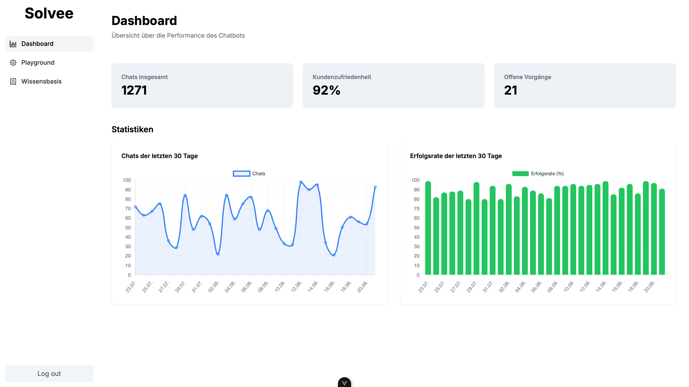
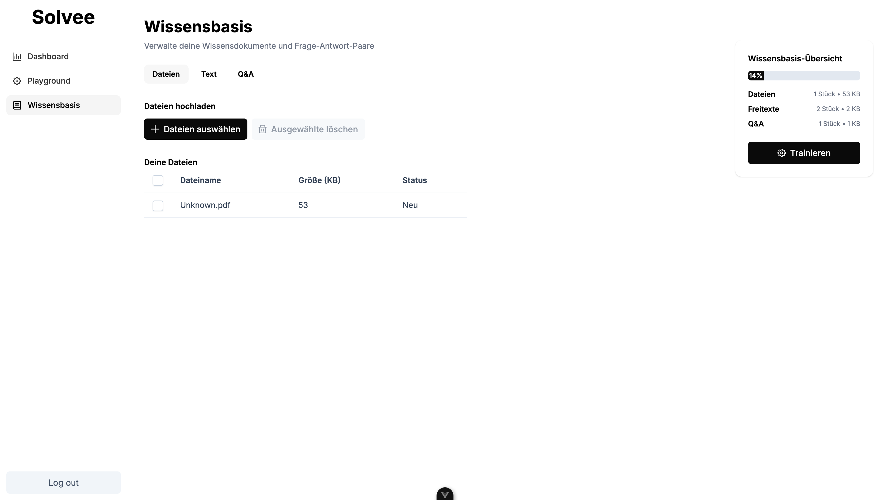

# Customer Support Dashboard

  

This project consists of three services:
- Qdrant (vector database)
- Backend (FastAPI)
- Frontend (Vue.js)

## Overview
- Purpose: A dashboard to manage an AI‑powered customer support chatbot (maintain knowledge base, test chat, deliver an embeddable widget).
- Architecture: Vue 3 frontend + FastAPI backend + Qdrant as vector store; Auth via Auth0; OpenAI for embeddings and answers.

## Features
- Knowledge Base: Upload files, auto‑extract (Docling), index in Qdrant, view and delete indexed files.
- Chat Playground: Send messages to the bot, view streamed responses, test prompt/history.
- Embedding: Serve an embeddable chat snippet via endpoint (`/embed/get/{bot_id}`).
- Dashboard: Example statistics and navigation for support workflows.
- Authentication: Login with Auth0, protected API routes in the backend.

## Quick Start

1. Copy `.env.example` to `.env` and fill in your keys.
2. Start all services:

   ```sh
   docker compose up --build
   ```

- Frontend: http://localhost:5173
- Backend: http://localhost:8000
- Qdrant: http://localhost:6333

## Project Structure
- `backend/` – FastAPI backend
- `frontend/` – Vue.js frontend

## Tech Stack
- Backend: FastAPI, SQLAlchemy, Auth0 (JWT verification), LangChain OpenAI (`text-embedding-3-large`), Qdrant Client/VectorStore, Docling (document extraction).
- Frontend: Vue 3, Vite, Pinia, Vue Router, PrimeVue, PrimeIcons, Tailwind CSS 4, Chart.js.
- LLM: OpenAI Chat (`gpt-4o-mini`) with streaming in the playground.
- Databases/Services: Qdrant (vector), Postgres (base schema), Docker Compose.

## Usage
- Knowledge Base:
  - Upload files; content is chunked and indexed in Qdrant.
  - View indexed files and delete by filename.
- Chat Playground:
  - Start a chat; requests go to `/generate`, responses are streamed.
  - For embeds, use `/generate/embed-chat` (non‑streaming).
- Embedding:
  - Fetch HTML snippet via `GET /embed/get/{bot_id}` and embed in the target system.

## API (Brief)
- `POST /generate/` – Generates a streamed answer from knowledge base + prompt.
- `POST /generate/embed-chat` – Non‑streaming answer for embedding.
- `POST /index/files` – Index files (multipart upload).
- `GET /index/indexed-files` – List indexed files.
- `DELETE /index/files/{filename}` or `POST /index/delete-file` – Remove an indexed file.
- `GET /embed/get/{bot_id}` – Embeddable HTML for the chat.

Note: The frontend talks to the backend via Vite proxy under `/api`. Target can be set via `VITE_API_URL` (see `frontend/vite.config.js`).

## Configuration
- Root `.env`:
  - `OPENAI_API_KEY`: OpenAI API key (required)
  - `QDRANT_API_KEY`: optional, if Qdrant is secured
  - `AUTH0_DOMAIN`, `AUTH0_API_AUDIENCE`, `AUTH0_ISSUER`, `AUTH0_ALGORITHMS`: for backend JWT verification
- Frontend variables (e.g., via Docker Compose):
  - `VITE_API_URL`: Backend base URL for the dev proxy
  - `VITE_AUTH0_DOMAIN`, `VITE_AUTH0_CLIENT_ID`, `VITE_AUTH0_AUDIENCE`: Auth0 configuration

## Notes
- Environment variables are loaded from `.env`.
- An OpenAI API key is required.
- Qdrant persists data in the `qdrant_data` volume.

## App

  

  <br/>


  

