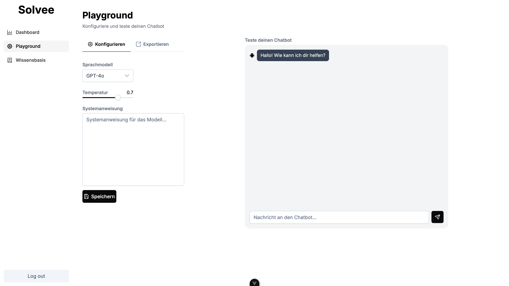

# Customer Support Dashboard

  

Dieses Projekt besteht aus drei Services:
- Qdrant (Vektor-Datenbank)
- Backend (FastAPI)
- Frontend (Vue.js)

## Überblick
- Zweck: Ein Dashboard zur Verwaltung eines KI‑gestützten Customer‑Support‑Chatbots (Wissensbasis pflegen, Chat testen, Einbettung bereitstellen).
- Architektur: Vue 3 Frontend + FastAPI Backend + Qdrant als Vektorspeicher; Auth via Auth0; OpenAI für Embeddings und Antworten.

## Funktionen
- Wissensbasis: Dateien hochladen, automatisch extrahieren (Docling), in Qdrant indizieren, indizierte Dateien einsehen und löschen.
- Chat‑Playground: Nachrichten an den Bot senden, gestreamte Antworten sehen, Prompt/Verlauf testen.
- Einbettung: Einbettbares Chat‑Snippet per Endpoint (`/embed/get/{bot_id}`) ausliefern.
- Dashboard: Beispielstatistiken und Navigation für Support‑Workflows.
- Authentifizierung: Login mit Auth0, geschützte API‑Routen im Backend.

## Schnellstart

1. Kopiere die Datei `.env.example` zu `.env` und trage deine Schlüssel ein.
2. Starte alle Services:

   ```sh
   docker compose up --build
   ```

- Frontend: http://localhost:5173
- Backend: http://localhost:8000
- Qdrant: http://localhost:6333

## Verzeichnisstruktur
- `backend/` – FastAPI Backend
- `frontend/` – Vue.js Frontend

## Technologien
- Backend: FastAPI, SQLAlchemy, Auth0 (JWT‑Verifikation), LangChain OpenAI (`text-embedding-3-large`), Qdrant Client/VectorStore, Docling (Dokumenten‑Extraktion).
- Frontend: Vue 3, Vite, Pinia, Vue Router, PrimeVue, PrimeIcons, Tailwind CSS 4, Chart.js.
- LLM: OpenAI Chat (`gpt-4o-mini`) mit Streaming im Playground.
- Datenbanken/Services: Qdrant (Vektor), Postgres (Basis‑Schema), Docker Compose.

## Nutzung
- Wissensbasis:
  - Dateien hochladen; Inhalte werden in Chunks zerlegt und in Qdrant indiziert.
  - Indizierte Dateien einsehen und per Dateiname löschen.
- Chat‑Playground:
  - Chat starten; Anfragen gehen an `/generate`, Antworten werden gestreamt.
  - Für Embeds steht `/generate/embed-chat` (nicht‑streamend) zur Verfügung.
- Einbettung:
  - HTML‑Snippet via `GET /embed/get/{bot_id}` laden und im Zielsystem einbinden.

## API (Kurzüberblick)
- `POST /generate/` – Generiert eine gestreamte Antwort aus Wissensbasis + Prompt.
- `POST /generate/embed-chat` – Nicht‑streamende Antwort für Einbettung.
- `POST /index/files` – Dateien indizieren (Multipart Upload).
- `GET /index/indexed-files` – Liste indizierter Dateien.
- `DELETE /index/files/{filename}` bzw. `POST /index/delete-file` – Indizierte Datei entfernen.
- `GET /embed/get/{bot_id}` – Einbettbares HTML für den Chat.

Hinweis: Frontend spricht das Backend über den Vite‑Proxy unter `/api` an. Ziel lässt sich via `VITE_API_URL` steuern (siehe `frontend/vite.config.js`).

## Konfiguration
- Root `.env`:
  - `OPENAI_API_KEY`: OpenAI API‑Key (erforderlich)
  - `QDRANT_API_KEY`: optional, falls Qdrant gesichert
  - `AUTH0_DOMAIN`, `AUTH0_API_AUDIENCE`, `AUTH0_ISSUER`, `AUTH0_ALGORITHMS`: für Backend‑JWT‑Verifikation
- Frontend‑Variablen (z. B. via Docker Compose gesetzt):
  - `VITE_API_URL`: Basis‑URL des Backends für den Dev‑Proxy
  - `VITE_AUTH0_DOMAIN`, `VITE_AUTH0_CLIENT_ID`, `VITE_AUTH0_AUDIENCE`: Auth0 Konfiguration

## Hinweise
- Die Umgebungsvariablen werden aus `.env` geladen.
- Für OpenAI wird ein API-Key benötigt.
- Qdrant persistiert Daten im Volume `qdrant_data`.

## Anwendung

  

  <br/>


  


